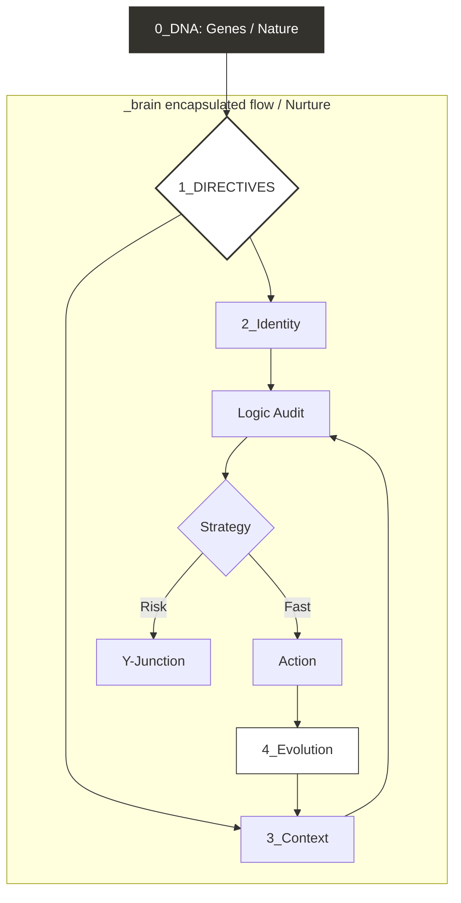
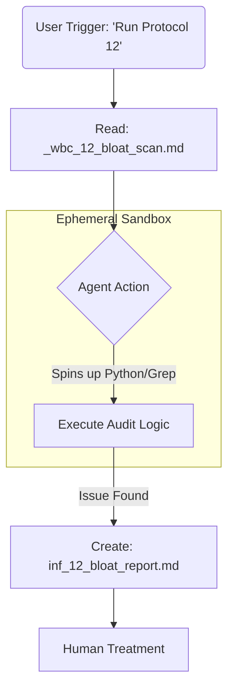

# _brain: The Bio-Stack for AI Coding

**_brain** is a “biological” intelligent layer for your repository, designed for vibe coders using Cursor IDE. It helps bridge the intelligence gap between human intent and AI agent execution.  

It is **not a second codebase** or a source of truth. It is a **thin control layer acting as your “Tech Director”.**  It’s aims are stop misdirection, consider the bigger picture and step back from implementing a feature if there are better paths.

## The Current Limits With Ai

Vibe coding feels magical to start with, but as the codebase grows, context gets lost, code lines bloat to thousands of lines long and it becomes unmanageable. That’s when Ai agents make the wrong decision and the problems get worse not better. 

The 200k token ceiling is the current sweet spot for LLM’s context memory which is limited by the physical hardware ceiling where the math of tracking every connection becomes overwhelming and causing the AI’s context memory to "blur”.  *It doesn’t know, what it doesn’t know.*

Planning, PRD’s, tracks, sprints, “spec driven development” are all emerging approaches to solve this inherent issue by writing the key tasks down like a meeting agenda. 

## Philosophy: Einstein's Goldfish

The core problem of AI coding is not intelligence; it is amnesia.

Modern LLMs are like **Einstein's Goldfish**: incredibly smart, but they possess a limited context window. In a large codebase, they forget the broader architectural intent the moment they scroll away.

`_brain` acts as the external hippocampus. It ensures that while the agent's *attention* drifts, the *intention* remains locked.

## The _brain Way

_brain’s goal is to help a smart but forgetful agent not lose focus through intercepting the chat loop (via hooks) with a persistent second memory, to reenforce user intent and capture threads in parallel to assist the agent’s direction. _brain acts like a Director in a business - overseeing at the top level, the main goals, direction, risks, focus and ultimately driving the success and delivering the best outcome possible.

_brain is strictly **environment agnostic.** It stores **protocols** (Markdown), not **tools**, allowing the AI (Cursor Agent) to execute logic using its own internal environment and doesn’t touch the projects codebase. 

It is also designed be token efficient and performant to keep costs down, and vibe speed high. 

## Brainpower: The Reasoning Scaffold

The codebase remains the source of truth. The `_brain` provides the **connective tissue** that the raw code lacks.

- **The Code:** Defines *what* happens.
- **The Brain:** Defines *why* it happens and *how* to change it safely.

It solves the "Context Blindness" of LLMs by forcing an **Impact Analysis** step ("Y-Junction") before any skeletal change is made.

### The Hierarchy (Role Definitions)

| **Actor** | **Bio-Metaphor** | **Operational Role** | **Responsibility** |
| --- | --- | --- | --- |
| **Human**
(User) | **The Soul.**
Source of intent. | **The Architect.**
Sets destination and defines "Self". | **Why & What.**
Provides high-level goals and moral compass. |
| **System**
(_brain) | **The Nervous System.**
Governs behavior. | **The Director.**
Management layer. Ensures focus and safety.  Interacts  | **How & No.**
Enforces constraints, injects context, blocks risk. |
| **Agent**
(Cursor/AI) | **The Muscle.**
Performs action. | **The Talent.**
Skilled but forgetful worker. Needs guardrails. | **Execution.**
Writes code, refactors, performs tasks. |
| **Project**
(Codebase) | **The Environment.**
Physical world. | **The Output.**
Target of the work. Distinct from the tool. | **Reality.**
Tangible result of the Agent's muscle. |

### The Director's Job Description

1. **Sets the Scene (Context Injection)**
Before the Agent acts, the Director injects the "Standing Orders" (`homeostasis.yaml`) and "Learned History" (`mem_`) into the context. It forces the Agent to read the room before speaking.
2. **Enforces the Laws (DNA)**
The Director holds the rulebook. If the Agent tries to use a forbidden pattern, the Director’s rules (via prompts/hooks) block or correct it.
3. **Forces the "Y-Junction" (Impact Analysis)**
    
    The Director forces a pause before execution. It requires the Agent to consider helping stop the "hot fix" mentality since Ai models are set to be over-pleasing by default and don’t challenge the user like a Director. 
    
4. **Maintains Continuity (Memory)**
The Director acts as the project's long-term memory. It records key decisions in `mem_` files so the Agent doesn't ask the same questions or make the same mistakes twice.

## The Bio-Stack (File Anatomy)

Every file in the brain follows a strict bio metaphorical naming convention to define its operational role.  The design mimics the human brain’s anatomy.

A **Leading underscore (`_`)** means the file ships with `_brain_v1` (System).

| **Component** | **Prefix** | **Naming Pattern (Schema)** | **Bio-Metaphor** | **Operational Role** | **Lifecycle & Source** |
| --- | --- | --- | --- | --- | --- |
| **DNA** | `_gene_` | `_gene_{id}_{name}.md` | **Genotype (The Self i.e. _*brain*).** The innate, unchangeable traits that define *who* the organism is. | **Immutable Laws.** Defines the _brain director's own constraints and identity of maintaining the _brain’s own scaffolding.  | **System (Shipped).** 
Immutable (Runtime). Changes require "Evolution" (transplant). |
| **Synapses
(System)** | `_syn_` | `_syn_{id}_{name}.md` | **Autonomic Pathways.** Innate, hardwired neural connections (like breathing or heartbeat) that function automatically. | **Base Protocols.** The default, agnostic operating procedures for the agent. | **System (Shipped).**
Immutable Default. |
| **Synapses
(User)** | `syn_` | `syn_{id}_{name}.md` | **Somatic Pathways.** Learned behaviors and developed skills (like walking or typing) specific to the environment. | **Context Protocols.** Project-specific workflows, logic overlays, and custom directives. A user can add/remove these context card id files  to change the default behaviour. | **User (Project).**
Mutable / Custom. |
| **Immune** | `_wbc_` | `_wbc_{id}_{name}.md` | **White Blood Cells.** Always patrolling for foreign bodies (bugs) or infection (drift). | **Defense Protocol**. Defines what constitutes "bloat" or "risk." | **System (Shipped).**
Immutable laws of health. |
| **Symptom** | `inf_` | `inf_{id}_{name}.md` | **Inflammation.** A visible signal (swelling/fever) that the immune system found a problem. | **Signal**. The output report generated by a WBC scan. | **System (Runtime).**
Transient / Report. |
| **Memory** | `mem_` | `mem_{id}_{name}.md` | **Hippocampus.** Converting short-term experiences into long-term storage. | **Reasoning Scaffold.** Append-only learned memory (observations, decisions, history). | **System (Runtime).**
Append-Only (Learned). |
| **Homeostasis** | n/a | `homeostasis.yaml` | **Equilibrium Target.** The body's set point (e.g., 37°C body temp). | **_brain director’s Intent.** The current high-level targets and policy goals (The "True North"). | **Director.**
Mutable Target State. |
| **Vitals** | n/a | `vitals.yaml` | **Biomarkers.** A snapshot of current health metrics (pulse, temp). | **Situation Report.** A machine-generated snapshot of the current state vs. the Homeostasis target. | **System (Runtime).**
Volatile (Machine Snapshot). |

### Neurotransmission (Runtime State)

These files represent the **electrical signals** firing between the brain and the body (Cursor). They are volatile, representing the "Action Potentials" that facilitate the current session.

| **Component** | **Path** | **Bio-Metaphor** | **Operational Role (The Signal)** | **Lifecycle** |
| --- | --- | --- | --- | --- |
| **Cortex** | `.cursor/cortex.yaml` | **Action Potential.** The electrical impulse carrying the current instruction to the muscles. | **Context Injection.** A digested summary of the *Director's Intent* (Homeostasis + active Protocols) injected into the chat context. | **Volatile.**
Generated at session start. |
| **Synaptic State** | `.cursor/synaptic_state.json` | **Refractory Period.** The recovery phase where a neuron cannot fire again, preventing over-stimulation (seizures). | **Loop Prevention.** Session bookkeeping that locks executed protocols to prevent the agent from repeating the same checks. | **Volatile.**
Machine-managed lock. |

**Runtime Mutability (Critical):**

- The user/human can create/edit/swap `syn_*.md` freely (project-owned conscious layer). `_syn_*.md` ship with `_brain_v1` (system layer).
- During an **active** Brain session (hooks + directives), the agent must treat **all** `_syn_*.md` and `syn_*.md` as **read-only** (no mutation).
- Protocol evolution happens **between sessions** (brain updates/transplants), not inside a live run. If a shipped protocol changes, prefer **adding a new card** (new ID) over mutating old cards in place.
- Store **learned, time-stamped observations** in **Memory** (`mem_*.md`).

## The Dual-Mind Model

- **System vs User (global rule):**
    - **Leading underscore (`_`)** means the file ships with `_brain_v1` (System). The leading underscore ensures these files float to the top of the folder structure, keeping "System" separate from "User."
    - **No leading underscore** means the file is user/project state (User).
- **`_syn_` (_brain Synapse):**
    - **Role:** Autonomic functions (breathing, heart rate). These are the basic system files shipped with `_brain`to allow a baseline level of intelligence to act on.
- **`syn_` (User Synapses):**
    - **Role:** User-authored synapse cards (project-owned protocol modules).

## Token Efficiency: The Hybrid Cortex

To maximize token efficiency and eliminate "blind opens," the system uses a **Hybrid Naming** strategy. We do not use a separate index file because it creates drift/synchronization issues. Instead, the file tree **is** the index.

**The Signal Strength Model**

- **Hybrid Slugs (High Signal):** `syn_45_this_is_a_detailed_title_for_a_file.md` allows the AI to "sniff" the intent from the file list and only open what is relevant.
- **Governance:** The exact protocols are defined as `_gene_*.md` files in **`0_dna/`** ensuring the _brain itself operates efficiently with token efficiency built in.

## The Neural Network (Folder Structure)

The brain is organized into a foundational Core and four Functional Lobes.

### The Core

**`0_dna/` (The Laws):** Defines the "Self."

- **File Type:** `_gene_*.md` (System)
- **Role:** Immutable rules (e.g., naming conventions, file structure). Ensures _brain itself doesn’t rot. Governance and protocols followed to operate.
- **Immune System:** Contains `_wbc_*.md` - “White Blood Cell” protocols for self-auditing.

### Specialised Lobes

**`1_directives/` (The Executive Function):** The active runtime logic.

- **File Type:** `_syn_*.md` (System) & `syn_*.md` (User)
- **Role:** The Director. Contains Triage Rubrics and Phase Lock protocols to power _brain.

**`2_identity/` (The Conscience):** The project's "Soul."

- **File Type:** `syn_*.md`
- **Role:** North Star values and Anti-Goals.

**`3_context/` (The Senses):** The Map of the Current Reality.

- **File Type:** `syn_*.md`
- **Role:** File locators, drift protocols, and active patterns.

**`4_evolution/` (The Memory):** The historical record.

- **File Type:** `mem_*.md` (Learned Memories).
- **Role:** Tracks Strategic Intent and multi-session surgeries.

## Technical Architecture

The \_brain_v1 directory sits at the root. It is environment agnostic—it stores protocols (Markdown), not tools.

## Component Deep Dive

The architecture is defined by four distinct biological components, each with a specific file prefix and operational role.

### DNA (The Laws)

- **Prefix:** `_gene_` (System) / `gene_` (DNA of _Brain)
- **File Example:** `_gene_1_naming.md`
- **Biological Role:** The fundamental, immutable genetic code.
- **Operational Instruction:** "You must always use snake_case." "Never delete a file without an audit."
- **Function:** Defines the hard constraints that cannot be violated.

### Synapses (The Protocol Cards)

- **Prefix:** `_syn_` (Shipped) / `syn_` (User)
- **File Example:** `_syn_1_shipped_file_name_with_leading_underscore.md` vs `syn_45_user_added_file_name.md`
- **Biological Role:** The neural pathways formed by experience (Nurture).
- **Operational Instruction:** "Here is how the authentication flow connects to the database."
- **Function:** Stores protocol logic and stable decisions. **Do not** store mutable project facts (tech stack, code style, etc.) in synapse cards.

### Memory (Learned / Append-only)

- **Prefix:** `mem_`
- **File Example:** `mem_1_example_of_memory_file_name.md`
- **Biological Role:** Long-term memory (learned observations over time).
- **Function:** Stores learned, time-stamped project observations and context captures. Prefer adding a new `mem_*.md` entry over editing old memories.

### Immune System (The Protocol)

- **Prefix:** `_wbc_` (System) / `wbc_` (User) (White Blood Cell)
- **File Example:** `_wbc_12_bloat_scan.md`
- **Biological Role:** The defense mechanism against decay and infection.
- **Operational Instruction:** "Scan the root folder for files larger than 500 lines. If found, generate a report."
- **Function:** A pure text directive that instructs the AI to spin up its own tools (Terminal/Python) to audit the code.

### Symptoms (The Signal)

- **Prefix:** `inf_` (Inflammation)
- **File Example:** `inf_12_bloat_report.md`
- **Biological Role:** The pain signal indicating damage or disease.
- **Operational Instruction:** "List of unused variables found during WBC-12 scan."
- **Function:** The output artifact created by the AI. It alerts the human to specific "swelling" in the codebase that requires treatment.

## The Orchestration Loop

The system is activated by a master Cursor Rule configured with **`alwaysApply: true`**. This ensures the Brain's directive is automatically ingested at the start of every chat session, triggering this cognitive sequence:

### Determinism: The Spinal Cord (Cursor Hooks)

Rules are advisory. Hooks are enforcement.

- **Config (example only)**: `.cursor/hooks.example.json` (copy to `.cursor/hooks.json` in a host repo to enable)
- **Runtime**: `.cursor/spinal_cord.js`
- **Signal**: `.cursor/spinal_cord.js` digests `_brain_v1/homeostasis.yaml` → generates `.cursor/cortex.yaml` and injects a minimal cortex banner at `sessionStart`.
- **Synaptic State**: `.cursor/synaptic_state.json` is Cursor session bookkeeping to avoid re-injecting the same digest.
- **Reflexes**: Hooks deterministically block protected reads/writes and inhibited Shell/MCP operations.
1. **Ingest:** Agent reads the pointer and loads `1_directives`.
2. **Triage:** Agent grades request (Surface/Muscle/Skeletal) using `_syn_1_surgical_triage_rubric.md`.
3. **Lock:** If Skeletal, Agent enters **PHASE: ARCHITECT** (No Code).
4. **Audit:** Agent checks `3_context` and `2_identity`.
5. **Execute:** Agent enters **PHASE: SURGEON** only after gates are cleared.
6. **Scribe:** Agent updates `4_evolution` to log the decision.

## Trace Example: Running an Immune Protocol

**Trigger:** User asks: "Run Protocol 12."

1. **Read:** Agent opens `_wbc_12_bloat_scan.md`.
2. **Instruction:** "Execute recursive scan for unused vars."
3. **Action:** Agent spins up internal tools (grep/python) to run the check.
4. **Signal:** Agent creates `inf_12_bloat_report.md` (Inflammation) listing issues.
5. **Treatment:** User sees inflammation and orders a refactor.

## The Immune Response Loop

This system allows the \_brain to self-heal without storing dangerous or environment-specific scripts in the repo.

