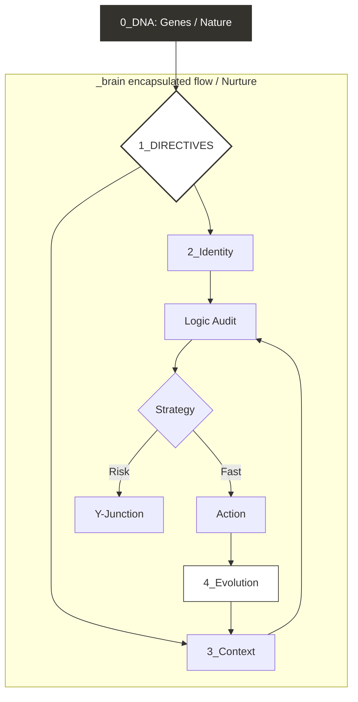
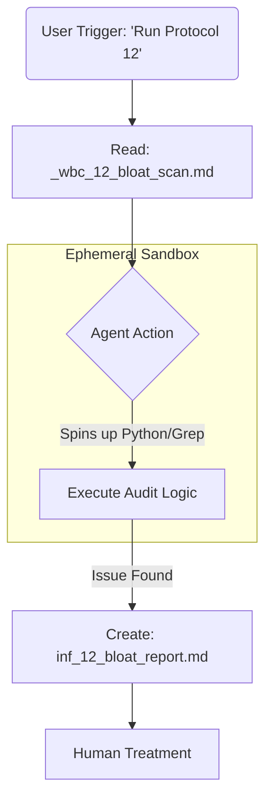

# _Brain

`_brain` is a versioned logic layer for coding agents. Source of truth: `_brain_v1/`.

## What is it?
- The Cursor rule (`.cursor/rules/_brain_on.mdc`) is a dumb redirect.
- It blocks output until directives in `_brain_v1/1_directives/` are ingested.

## Entry Points
- **For Humans**: Start at [0_dna/0_dna_readme.md](_brain_v1/0_dna/0_dna_readme.md)
- **For Agents**: Enforced by `.cursor/rules/_brain_on.mdc` → `_brain_v1/1_directives/`

# _Brain_Transplant
- This is _brain_v1 and lives in the root of your repo project
- Do a "brain transplant" when you want to change version by swapping the entire "_brain_v1" folder for the new version. 
- Update the rule

# \_brain: The Bio-Stack for AI Coding

**\_brain** is a biological operating system for your repository. It bridges the intelligence gap between human intent and AI execution by treating the codebase as a living organism.

It is **not a second codebase** or a source of truth. It is a **thin control layer**—an attention and reasoning scaffold—that sits between the user and the repo. It helps a smart but forgetful agent use its limited context window to understand how "Doing X will affect Y because of Z."

It is strictly **environment agnostic** but highly optimized for "vibe coding" with Cursor. It stores **protocols** (Markdown), not **tools**, allowing the AI (Cursor Agent) to execute logic using its own internal environment.

## Philosophy: Einstein's Goldfish

The core problem of AI coding is not intelligence; it is amnesia.

Modern LLMs are like **Einstein's Goldfish**: incredibly smart, but they possess a limited context window. In a large codebase, they forget the broader architectural intent the moment they scroll away.

`_brain` acts as the external hippocampus. It ensures that while the agent's *attention* drifts, the *intention* remains locked.

## The Superpower: The Reasoning Scaffold

The code remains the source of truth. The `_brain` provides the **connective tissue** that the raw code lacks.

* **The Code:** Defines *what* happens.

* **The Brain:** Defines *why* it happens and *how* to change it safely.

It solves the "Context Blindness" of LLMs by forcing an **Impact Analysis** step ("Y-Junction") before any skeletal change is made.

## The Bio-Stack (File Anatomy)

Every file in the brain follows a strict biological naming convention to define its operational role.

| Component | Prefix | Example | Operational Role | 
 | ----- | ----- | ----- | ----- | 
| **DNA** | `_gene_` | `_gene_1_naming.md` | Immutable Laws (shipped). "You must use snake_case." | 
| **Subconscious** | `_syn_` | `_syn_1_surgical_triage_rubric.md` | **System Logic.** Internal autonomic functions (shipped). | 
| **Conscious** | `syn_` | `syn_50_auth.md` | **User Logic.** Active thoughts and project context. | 
| **Immune** | `_wbc_` | `_wbc_12_bloat_scan.md` | Defense Protocol (shipped). "Scan for bloat > 500 lines." | 
| **Symptom** | `inf_` | `inf_12_bloat_report.md` | Signal. The output report generated by a WBC scan. | 
| **Homeostasis** | (singleton) | `homeostasis.yaml` | Read-only state snapshot (vitals + gates) updated by WBC scans. |

## The Dual-Mind Model

The system distinguishes between **Subconscious** (System) and **Conscious** (User) operations using a standard coding convention.

* **System vs User (global rule):**

  * **Leading underscore (`_`)** means the file ships with `_brain_v1` (System).
  * **No leading underscore** means the file is user/project state (User).

* **`_syn_` (The Subconscious):**

  * **Role:** Autonomic functions (breathing, heart rate). These are the "System" files shipped with `_brain`.

  * **Sorting:** The leading underscore ensures these files float to the top of the folder structure, keeping "System" separate from "User."

  * **Safety:** Allows for safe updates. "Delete all files starting with `_`" is a safe wildcard command to upgrade the brain without wiping user memories.

* **`syn_` (The Conscious):**

  * **Role:** Active thoughts. These are the "User" files created during the project lifecycle.

  * **Sorting:** These sit comfortably below the system files.

## Token Efficiency: The Hybrid Cortex

To maximize token efficiency and eliminate "blind opens," the system uses a **Hybrid Naming** strategy. We do not use a separate index file (like a `CORTEX.md`) because it creates drift/synchronization issues. Instead, the file tree **is** the index.

**The Signal Strength Model**

* **Strict IDs (Low Signal):** `syn_45.md` requires the AI to open the file to know its contents (Wasted Tokens).

* **Hybrid Slugs (High Signal):** `syn_45_auth_flow.md` allows the AI to "sniff" the intent from the file list and only open what is relevant.

**The Naming Protocol**

* **Format:** `{prefix}{id}_{slug}.md` (prefix includes trailing underscore, e.g. `_syn_`, `_gene_`)

* **Slug Rule:** The slug must be 3-5 semantic keywords.

* **Governance:** The exact length limits and style (snake_case) are defined in `_gene_1_naming.md`.

## The Neural Network (Folder Structure)

The brain is organized into a foundational Core and four Functional Lobes.

### The Core

**`0_dna/` (The Laws):** Defines the "Self."

* **File Type:** `_gene_*.md` (System) & `gene_*.md` (User)

* **Role:** Immutable rules (e.g., naming conventions, file structure).

* **Immune System:** Contains `_wbc_*.md` (System) & `wbc_*.md` (User) White Blood Cell protocols for self-auditing.

### Specialised Lobes

**`1_directives/` (The Executive Function):** The active runtime logic.

* **File Type:** `_syn_*.md` (System) & `syn_*.md` (User)

* **Role:** The Director. Contains Triage Rubrics and Phase Lock protocols.

**`2_identity/` (The Conscience):** The project's "Soul."

* **File Type:** `syn_*.md`

* **Role:** North Star values and Anti-Goals.

**`3_context/` (The Senses):** The Map of the Current Reality.

* **File Type:** `syn_*.md`

* **Role:** Tech stack map, file locators, and active patterns (Not the code itself, but the *map* of the code).

**`4_evolution/` (The Memory):** The historical record.

* **File Type:** `syn_*.md` (Protocols) & `mem_*.md` (Learned Memories).

* **Role:** Tracks Strategic Intent and multi-session surgeries.

## Technical Architecture

The \_brain_v1 directory sits at the root. It is environment agnostic—it stores protocols (Markdown), not tools.

## Component Deep Dive

The architecture is defined by four distinct biological components, each with a specific file prefix and operational role.

### DNA (The Laws)

* **Prefix:** `_gene_` (System) / `gene_` (User)

* **File Example:** `_gene_1_naming.md`

* **Biological Role:** The fundamental, immutable genetic code.

* **Operational Instruction:** "You must always use snake_case." "Never delete a file without an audit."

* **Function:** Defines the hard constraints that cannot be violated.

### Memories (The Context)

* **Prefix:** `_syn_` (System) / `syn_` (User)

* **File Example:** `_syn_1_surgical_triage_rubric.md` vs `syn_45_auth_flow.md`

* **Biological Role:** The neural pathways formed by experience (Nurture).

* **Operational Instruction:** "Here is how the authentication flow connects to the database."

* **Function:** Stores project knowledge, logic flows, and learned architectural patterns.

### Immune System (The Protocol)

* **Prefix:** `_wbc_` (System) / `wbc_` (User) (White Blood Cell)

* **File Example:** `_wbc_12_bloat_scan.md`

* **Biological Role:** The defense mechanism against decay and infection.

* **Operational Instruction:** "Scan the root folder for files larger than 500 lines. If found, generate a report."

* **Function:** A pure text directive that instructs the AI to spin up its own tools (Terminal/Python) to audit the code.

### Symptoms (The Signal)

* **Prefix:** `inf_` (Inflammation)

* **File Example:** `inf_12_bloat_report.md`

* **Biological Role:** The pain signal indicating damage or disease.

* **Operational Instruction:** "List of unused variables found during WBC-12 scan."

* **Function:** The output artifact created by the AI. It alerts the human to specific "swelling" in the codebase that requires treatment.

## The Orchestration Loop

The system is activated by a master Cursor Rule configured with **`alwaysApply: true`**. This ensures the Brain's directive is automatically ingested at the start of every chat session, triggering this cognitive sequence:

1. **Ingest:** Agent reads the pointer and loads `1_directives`.

2. **Triage:** Agent grades request (Surface/Muscle/Skeletal) using `_syn_1_surgical_triage_rubric.md`.

3. **Lock:** If Skeletal, Agent enters **PHASE: ARCHITECT** (No Code).

4. **Audit:** Agent checks `3_context` and `2_identity`.

5. **Execute:** Agent enters **PHASE: SURGEON** only after gates are cleared.

6. **Scribe:** Agent updates `4_evolution` to log the decision.

## Trace Example: Running an Immune Protocol

**Trigger:** User asks: "Run Protocol 12."

1. **Read:** Agent opens `_wbc_12_bloat_scan.md`.

2. **Instruction:** "Execute recursive scan for unused vars."

3. **Action:** Agent spins up internal tools (grep/python) to run the check.

4. **Signal:** Agent creates `inf_12_bloat_report.md` (Inflammation) listing issues.

5. **Treatment:** User sees inflammation and orders a refactor.

## The Immune Response Loop

This system allows the \_brain to self-heal without storing dangerous or environment-specific scripts in the repo.

